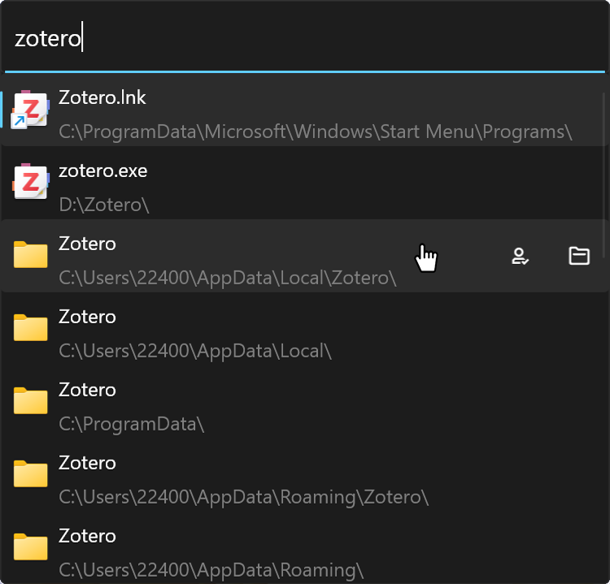
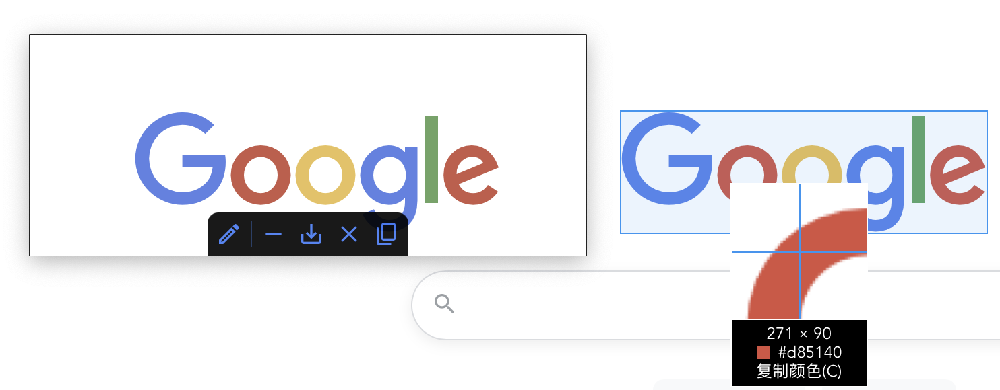

<p align="center">
  <a href="https://github.com/Horbin-Magician/rotor" target="_blank" rel="noopener noreferrer">
    
  </a>
</p>

<p align="center">
  <strong>A fast, lightweight desktop toolbox for Windows and macOS.</strong>
</p>

<p align="center">
  <span>English</span>
  <span> | </span>
  <a href="./doc/README_CN.md">中文</a>
</p>

<div align="center">

[](./LICENSE)
[](https://github.com/Horbin-Magician/rotor/releases)


</div>

## About Rotor

Rotor keeps frequently used desktop tools one shortcut away while remaining fast and
lightweight. It currently provides file search, screenshots and pinned images, local
screenshot OCR, and configurable quick actions.

## Features

### File search

- Open the search window with `Cmd+Shift+F` on macOS or `Ctrl+Shift+F` on Windows.
- Search indexed files as you type and navigate the results with the keyboard.
- Press `Enter` to open a result, or use the item actions to reveal it in its folder.
- On Windows, supported results can also be opened as administrator.
- Configure excluded directory names or paths from Settings.

<p align="center">
  
</p>

### Screenshots and pinned images

- Start a capture with `Cmd+Shift+S` on macOS or `Ctrl+Shift+S` on Windows.
- Select an area across connected displays and pin the result above other windows.
- Annotate a pin with a pen, rectangle, arrow, or text.
- Run local OCR on a pinned image and select the recognized text.
- Zoom, save, copy, hide, restore, or close pinned images.

Default pin shortcuts:

| Action | Shortcut |
| --- | --- |
| Save | `S` |
| Copy | `Enter` |
| Hide | `H` |
| Close | `Escape` |

<p align="center">
  
</p>

### Quick actions

Create global shortcuts that run terminal commands. Actions can be added, edited,
disabled, tested from Settings, and assigned their own shortcuts. Rotor includes
starter actions for opening a terminal and the platform file manager.

### Settings and diagnostics

- Customizable global and pin-window shortcuts.
- System, light, and dark themes with English and Chinese interfaces.
- Configurable screenshot save behavior and search exclusions.
- System overview for memory use, search index state, and relevant permissions.
- Automatic update checks.

## Installation

Download the latest installer from [GitHub Releases](https://github.com/Horbin-Magician/rotor/releases/latest):

- Windows: use the NSIS installer.
- macOS: use the DMG image.

macOS requires Screen Recording permission for screenshots. Windows installs per
machine and may request administrator privileges.

## Development

Rotor uses [Tauri 2](https://tauri.app/), Rust 2021, Vue 3, and TypeScript.

### Prerequisites

- The [Tauri development prerequisites](https://v2.tauri.app/start/prerequisites/)
- Rust and Cargo
- Node.js with Yarn `1.22.22`

### Run locally

```bash
yarn install
yarn tauri dev
```

Run only the frontend development server:

```bash
yarn dev
```

### Checks and builds

```bash
# Frontend type check, lint, formatting check, and build
yarn typecheck
yarn lint
yarn format:check
yarn build

# Rust workspace
cd src-tauri
cargo check --workspace
cargo test --workspace

# Platform application bundle
cd ..
yarn tauri build
```

The main code is split between `src/` for the Vue frontend and `src-tauri/` for the
Tauri application and Rust workspace crates.

## Contributing

Issues and pull requests are welcome. Keep changes focused, run the relevant frontend
and Rust checks, and test platform-specific behavior on the affected operating system.

## License

Rotor is available under the [MIT License](./LICENSE).

Copyright (c) 2024-present Horbin
