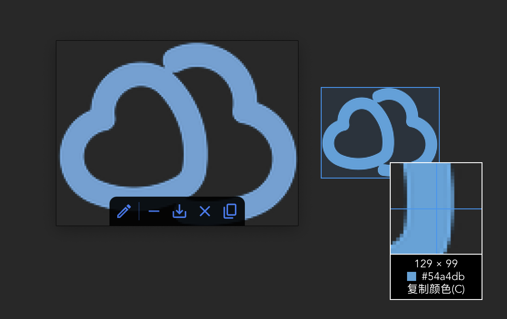

<a href="../README.md">English</a>
 | 
中文

一款快速、低占用、免费的工具箱，适用于Windows和MacOS操作系统

# 什么是小云管家?

小云管家（Rotor）是一款跨平台的 **快速**、**低占用**、**免费** 工具箱

目前，小云管家包含了 **文件搜索**，以及 **截图** 模块。

# 模块

## 文件搜索

1. 按下快捷键 `Shift+F` 即可显示搜索窗口；
2. 接着，你可以输入任何关于文件名的信息，相关文件会立即显示在下方；
3. 按方向键 `上` 和 `下` 选择所需的文件，按回车键 `Enter` 打开相应文件； 
4. 当鼠标悬停在结果项上时，将显示菜单。您可以打开文件所在的目录或以管理员身份运行该文件。

 

## 截图

1. 按下快捷键 `Shift+C` 即可开始截图；
2. 接着通过按住 `鼠标左键` 拖动选择你需要截图的区域，松开即可完成；
3. 默认情况下，捕获的图像将被固定在屏幕上，按 `ESC` 关闭它，按 `s` 保存它，按回车键 `Enter` 复制它，按 `h` 最小化它。

 

# 贡献

本项目由 [Rust](https://www.rust-lang.org/) 编写，使用 [Tauri](https://github.com/tauri-apps/tauri/) 作为GUI框架

我诚挚地邀请您为本项目建言献策及提供高质量的代码。

## 重要待办列表

- [ ] 贴图OCR功能，像微信一样直接划选并复制贴图中的文字。

# 开源协议

[MIT](https://opensource.org/licenses/MIT)

Copyright (c) 2022-present, Horbin
