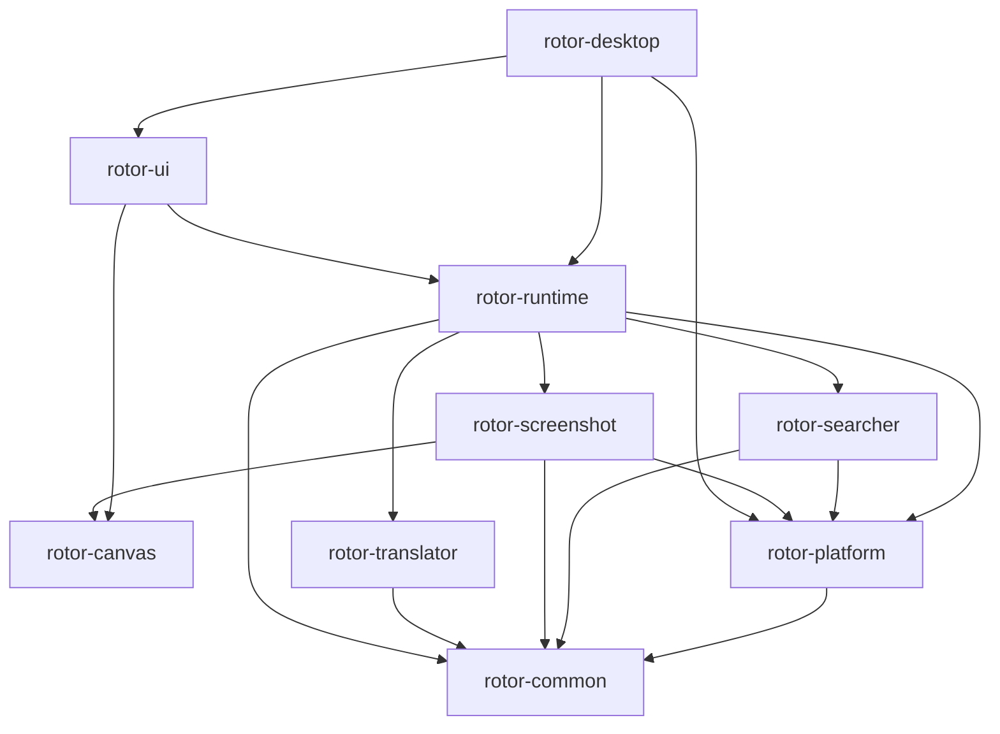

# Rotor：GPUI + gpui-component 开发迁移计划

制定日期：2026-09-07。开发分支：`refactor/gpui`。代码基线：`master` 的 `40addee065765ed343e665d6a712b3e9cbe2bdcc`（`chore: release v2.6.0`）。

优先级更新（2026-09-08）：所有剩余任务之前，先参考旧 UI 完成原生 UI 现代化美化，美观度和实用性均不得低于旧 UI。具体范围与验收要求见 [剩余任务汇总第 0 节](remaining-tasks.md#0-第一优先级ui-现代化美化先于其余剩余任务)；后续阶段按该汇总的执行顺序推进。

当前已建立根 workspace 和原生壳，P1–P8 主要代码通路已接入；44 项当前实现及证据边界见 [功能对照](feature-parity.md)。Windows UI、安装、性能与最终切换仍未完成，macOS 按用户要求暂缓。独立 P0 原型已于 2026-09-09 退役，历史源码与本地证据见[清理记录](evidence/experiment-removal.md)。下文是阶段要求，只有完整证据满足要求才能勾选，代码交付不等于 G0–G9 通过。

配套文档：

- [剩余任务汇总](remaining-tasks.md)：截至 2026-09-08 的未完成项，区分已实现待验收与尚待实施的工程切换。
- [功能与代码迁移对照](feature-parity.md)：逐项功能、现有入口、目标位置、兼容约束。
- [验证、性能与发布验收](validation.md)：可复现的测试场景、指标、发布检查和证据模板。

## 1. 目标与范围

使用 GPUI 管理桌面应用和窗口，使用 gpui-component 构建常规控件，使用 Rust 实现截图画布和标注。最终移除 Vue、TypeScript、Konva、Vite、Tauri 运行时及 WebView 数据桥接，保留现有 Rust 业务能力。

首个 GPUI 正式版本必须覆盖文件搜索、截图、贴图、OCR、输入/划词翻译、设置、快捷操作、托盘、自启动、单实例、更新和安装卸载。完整边界以功能对照表为准，不能用只有设置窗口的演示程序代表迁移完成。

平台范围沿用当前实际发布渠道：Windows x64、macOS arm64。Windows ARM、macOS Intel 和 Linux 不作为本次首发新增目标；当前 CI 虽安装 Intel macOS target，实际发布任务只构建 arm64。最低操作系统版本在 P0 核实并记录，不能从框架平台列表推断兼容范围。

“纯 Rust”指应用和 GUI 开发、运行不依赖 JS/WebView；保留操作系统 API、显卡驱动、ONNX/OCR 等必要的原生依赖。NSIS、签名和 DMG 等发布工具不要求由 Rust 实现。

本次不同时重写搜索索引算法、更换 OCR 模型、改变翻译供应商协议或增加新工作区管理功能。界面允许按组件库调整布局，但快捷键、数据、功能结果和主要操作流程应保持连续。

## 2. 基线核对与优先处理的问题

以下为制定计划时从 `40addee` 确认的基线问题，不是当前实现状态；核心解耦和配置事务等后续改动见功能对照表：

1. `rotor-common` 和 `rotor-platform` 没有直接 Tauri 依赖；搜索、截图、翻译和运行时仍依赖 Tauri 窗口或快捷键类型。
2. 翻译不仅有 Google/自定义模板，还包括 DeepSeek 流式输出；前端用请求序号隔离旧结果。
3. 截图包含会话编号、已就绪会话恢复、多屏焦点切换、缓存预建贴图和过期请求防护。
4. 贴图有裁剪边缘调整、跨屏缩放、最小化状态恢复；保存/复制成功后关闭并删除该贴图记录，失败或取消时保留。
5. OCR 使用 PP-OCRv6 tiny 资源、结果合并和约 30 秒空闲释放；这些是当前低占用行为的一部分。
6. 配置位于用户 home 下 `.rotor/config.toml`；贴图位于 `.rotor/shotter/record.toml` 和 `.rotor/shotter/default/{id}.png`。
7. Windows 以 NSIS per-machine 安装，启动尝试提权；macOS 为 app/DMG。更新有签名校验和 Gitee/GitHub 两个元数据地址。
8. 当前全局配置写入会先更新内存再写磁盘；新服务要明确失败时的回滚边界，避免快捷键、磁盘和内存不一致。

源文件入口及兼容细节见 [功能对照](feature-parity.md)。当 AGENTS.md/历史介绍与基线实现不一致时，先记录差异，再按实际功能制定验收。

## 3. 技术决策

### 3.1 GPUI 与组件库版本策略

技术方向已确定为 GPUI + gpui-component。版本配对是第一项工程验证，不将不同发布系列的示例直接混用。

- 查询时，组件库安装文档推荐 `gpui-kit` 0.6 系列作为配套入口；其仓库 manifest 中，组件库为 0.6.0，底层采用名为 `gpui-pre` 的 0.3.1 包别名。它与 docs.rs 上 `gpui` 0.2.2 的 API 文档不是同一个版本集合。[安装文档](https://gpui-kit.com/docs/installation/)、[配套 manifest](https://github.com/longbridge/gpui-kit/blob/main/Cargo.toml)、[gpui 0.2.2 窗口接口](https://docs.rs/gpui/0.2.2/gpui/struct.WindowOptions.html)
- P0 优先验证组件库官方配套发布组合，审查 `gpui-pre` 与 GPUI 上游的来源/补丁关系，记录真正解析的包名、版本、仓库和 API 文档。若采用 Kit，只使用所需原生组件和资源层，检查最终依赖树不包含 shell/QuickJS/WebView。
- 如果当前配套组合不满足最低系统版本或窗口能力，优先验证兼容的 GPUI + gpui-component 历史发布组合，或对明确的窗口缺口做小范围平台补丁；不以换用其他 GUI 框架作为默认处理。
- 正式锁定精确直接依赖、`Cargo.lock` 和 Rust 工具链。Git 依赖必须固定 commit；禁止跟随浮动 main。框架升级单独提交并重跑窗口/IME/画布测试。
- 安装文档列出 Rust 1.90+、Windows 10+、macOS 15+。这些先作为候选环境要求；特别区分开发机要求、构建 SDK 要求和生成二进制的最低运行版本。仓库没有明确承诺旧版 macOS 支持，P0 必须核实，不能默默抬高门槛。本机仅确认 Rust/Cargo 1.97.0 可用，尚未证明此组合可编译。[环境要求](https://gpui-kit.com/docs/installation/)

P0 输出 `dependency-baseline.md`，包含锁定组合、features、目标系统、来源 SHA、已知补丁、构建命令及两端运行结果；它是后续所有阶段的输入。

### 3.2 最终职责与目录

以下为目标结构，不代表文件已经存在：

```text
Cargo.toml / Cargo.lock / rust-toolchain.toml
crates/
  rotor-desktop/       # 二进制、GPUI 启动、窗口注册表、系统事件接入
  rotor-ui/            # GPUI 视图、组件封装、主题、键盘与焦点交互
  rotor-runtime/       # 用例编排、任务生命周期、配置/快捷操作事务
  rotor-common/        # 配置、数据路径、共享值类型、国际化
  rotor-platform/      # Windows/macOS OS 能力及原生窗口扩展
  rotor-searcher/      # 索引、查询、排名、图标数据
  rotor-screenshot/    # 捕获、截图会话、缓存、贴图记录、OCR
  rotor-translator/    # 翻译引擎、流式协议、目标语言规则
  rotor-canvas/        # 标注文档、几何变换、撤销、离屏合成
assets/               # 图标、OCR 模型、必要字体与许可
packaging/windows/    # NSIS、manifest、更新安装辅助程序配置
packaging/macos/      # app bundle、plist、DMG、签名配置
xtask/                # 版本、资源校验、打包与更新元数据命令
doc/gpui-migration/
```

依赖方向：



业务 crate 不依赖 GPUI、Tauri、窗口句柄或 UI Entity。`rotor-canvas` 不依赖 GUI；UI 和离屏导出共享同一个标注文档。`rotor-platform` 接收经过封装的原生句柄，不反向引用 GPUI 类型。`rotor-ui` 只向用例服务发请求，不直接写配置、注册全局快捷键或启动 shell。

### 3.3 过渡工程布局

1. P0 在 `experiments/gpui-probe` 创建独立的小型 Cargo workspace，验证窗口/IME/事件循环；不引入现有业务 crate，不提前搬迁整个仓库。
2. P1 建立根 Cargo workspace，暂时保留共享 crate 的 `src-tauri/crates/*` 路径，加入 `crates/rotor-desktop`、`crates/rotor-ui`、`crates/rotor-canvas` 和旧 `src-tauri` 应用包。
3. 移除旧 manifest 的嵌套 `[workspace]`，将 workspace profile 移到根；以现有 `src-tauri/Cargo.lock` 为基础迁移锁文件并审查差异，避免顺手升级全部依赖。P0 原型保持独立、从根 workspace 排除，验证代码随后吸收到正式应用。
4. 根 workspace 的 `default-members` 选择 GPUI 应用；旧 Tauri CLI 的配置位置和 Vue 构建命令继续可用。Rust 2021 业务 crate 可以与需要更新 edition 的 GUI crate 共存，统一工具链不等于全量改 edition。
5. 把业务 crate 中的 Tauri 适配移到旧应用的 `src-tauri/src/integration/*`；旧壳和 GPUI 壳消费同一业务接口。两者是分别启动的程序，不在同一进程运行两个 UI 事件循环。
6. GPUI 开发程序使用独立名称、实例标识、数据目录和更新通道。P1 新增 `ROTOR_DATA_DIR` 路径覆盖并注入现有全局配置初始化之前；测试只使用临时目录或旧数据副本。A/B 运行时不能同时注册相同快捷键。
7. P9 再将旧路径下的业务 crate 搬到根 `crates/`，移动资源、删除旧壳和前端，更新所有路径和 CI。

### 3.4 事件、线程与生命周期

- GPUI 主线程拥有所有窗口、Entity、焦点状态和视图更新；异步回调通过受支持的前台调度接口更新仍存活的弱引用。禁止把 `Window`/`Context` 跨线程保存或跨 await 持有借用。
- 应用级独立 Tokio runtime 承担 reqwest、翻译流和后台 I/O；保留现有搜索工作线程，捕获/OCR/PNG 合成进入有上限的阻塞任务队列。不要假定 GPUI executor 能直接执行依赖 Tokio reactor 的代码。
- 为搜索引入 `QueryId`，翻译引入 `TranslationId`，截图沿用语义明确的 `CaptureSessionId`，贴图使用 `PinId + generation`。旧结果、旧窗口重建后的回调不能覆盖新状态。
- 搜索/进度事件允许合并到最新状态；流式文本必须有序且无丢字，可合并相邻 delta，但不能丢中间增量；完成/失败/取消必须能送达。队列设容量与背压，UI 通知按批次合并。
- 全局快捷键、托盘事件通过回调/阻塞接收唤醒前台调度，不使用高频空轮询。注册/销毁遵守库要求的线程：macOS 主线程，Windows 对应 Win32 消息循环线程。[global-hotkey](https://github.com/tauri-apps/global-hotkey)、[tray-icon](https://github.com/tauri-apps/tray-icon)
- 窗口关闭时取消或断开其任务订阅；搜索窗口隐藏时释放查询结果并发送原有 release 语义；GPU 图像/画布引用按可见性和使用情况释放。
- 真正退出按“停止新请求 → 注销快捷键 → 取消任务 → 限时刷新贴图记录 → 销毁托盘/窗口 → 结束 runtime”执行。关闭普通窗口仍允许后台常驻，显式退出才结束进程。

### 3.5 窗口与坐标模型

窗口注册表使用 `Settings`、`Searcher`、`Translator`、`Mask(MonitorId)`、`Pin(PinId)` 这样的类型化键。旧字符串 label 只在兼容层解释，不再作为图像所有权依据。

坐标类型至少区分：桌面物理像素、显示器局部物理像素、窗口逻辑坐标、源图像像素、视图缩放。固定源图像原点、显示器缩放、当前窗口缩放、用户 zoom 的含义；所有变换集中在几何模块，窗口移动不能重复应用 DPI。

截图建立会话时记录显示器拓扑快照。屏幕拔插或模式变化时使该会话失效并重建遮罩。选区在有效源图像内截断；负桌面坐标合法。沿用按显示器遮罩的功能范围，跨两个显示器拼接成长图属于范围外的新功能。

Windows 的置顶、任务栏可见性、无边框、首次显示焦点和提权交互，以及 macOS 的 level、Spaces/fullscreen、Dock/菜单栏激活策略，由平台层按窗口角色处理。透明窗口参数存在不等于这些行为均已支持，必须完成 V01–V05。

### 3.6 截图、标注与导出

- 捕获结果以 `Arc<RgbaImage>` 或等价只读图像共享，缓存键包含会话和图像版本；同一截图不在多个 Entity 中复制整帧。GPUI 纹理上传次数需要可观测。
- 原始 RGBA → 渲染纹理；不保留 PNG → IPC → JS → Canvas 链路，也不承诺没有 CPU/GPU 上传开销。通道顺序、alpha 预乘、色彩空间和行跨度在 P0/P5 用测试图确认。
- 新 `AnnotationDocument` 保存 Pen/Rect/Arrow/Text、绘制顺序、颜色、宽度、文本样式及源图坐标；undo 栈只记录有效操作。首次迁移不新增 redo 或跨重启的可编辑标注能力。
- GPUI 元素负责交互和显示；离屏合成生成可保存/复制/OCR 的像素，不能截取桌面上的贴图窗口来导出，也不能包含工具栏、选区控制柄或 OCR 选择层。
- 当前 Konva 导出受 zoom 和屏幕 scaleFactor 影响。P0/P6 先建立实际尺寸/像素样例；首发按基线保留默认语义。若要改为固定源图尺寸导出，单独记录行为变更和数据证据。
- 离屏文本必须支持中文、字体回退及相同布局，`image` 本身不能完成字体排版。P0/P6 验证与 GUI 兼容的文字排版、光栅化路径；几何可采用成熟 Rust 栅格库，避免自己实现字体系统。
- OCR 输入是合成后的图像快照，回调携带图像版本；标注/裁剪变化后旧 OCR 缓存失效。保留行合并规则、复制选择和空闲释放，不因 GPUI 重绘重复运行推理。

### 3.7 系统服务替换

| 现有能力 | 首选迁移路径 | 必须验证 |
|---|---|---|
| Tauri 全局快捷键 | 独立 `global-hotkey` + runtime 事务 | Press/Release、键名兼容、去抖、注册失败与回滚 |
| Tauri 托盘 | 独立 `tray-icon` 及菜单支持 | 两端事件循环、菜单语言、退出、重建 |
| 文本/图像剪贴板 | 统一 ClipboardService；优先验证 `arboard`，必要处使用原生扩展 | PNG/RGBA 互通、占用重试、复制成功判定、change count |
| 保存/目录对话框 | GPUI 支持的原生对话框；缺口验证 `rfd` | 模态父窗口、线程要求、取消/失败、焦点返回 |
| 自启动 | 平台层管理 Windows 现有启动项和 macOS LaunchAgent | 原路径迁移、状态查询、禁用删除、无重复项 |
| 单实例与进程操作 | 平台锁/命名互斥体 + 小型启动协调层 | 提权前后、第二次启动、旧版共存和退出重启 |
| 日志 | 保留 `log` facade，桌面入口安装文件/控制台后端 | 日志目录、轮转、无 ANSI 文件日志、错误可定位 |
| 版本/资源/URL | Rust 版本元数据、ResourceLocator、现有 open_url 平台能力 | 安装目录外启动、app Resources、带空格路径 |
| 自动更新 | 独立 UpdateService + 签名验证 + 平台安装辅助流程 | 旧 updater 升级、新版后续升级、失败恢复 |

上述 crate 来自独立库，即便由 tauri-apps 维护也不意味着需要 Tauri 运行时；P1/P8 用依赖树实际验证。[剪贴板库](https://github.com/1Password/arboard)、[对话框库](https://github.com/PolyMeilex/rfd)

## 4. 开发阶段与依赖

默认一名开发者持续负责，不假设额外人手。UI、核心、平台、发布是职责分类，不代表已指派人员。工期为初始工程量估计，P0 后重估。

| 阶段 | 内容 | 前置 | 估计人日 | 完成门槛 |
|---|---|---|---|---|
| P0 | 版本、基线、跨平台原型 | 无 | 4–6 | G0：两端关键窗口与依赖可行 |
| P1 | workspace 与核心解耦 | G0 | 4–6 | G1：新旧壳共享独立业务核心 |
| P2 | 桌面常驻与系统服务 | G1 | 4–6 | G2：托盘/热键/焦点/退出可靠 |
| P3 | 设置、主题、快捷操作 | G2 | 4–6 | G3：配置和快捷操作完整 |
| P4 | 搜索与翻译 | G3 | 3–5 | G4：输入、查询、三种引擎完整 |
| P5 | 多屏截图与会话 | G2，按默认顺序在 G4 后 | 5–8 | G5：会话状态、DPI、像素正确 |
| P6 | 贴图、标注、导出与持久化 | G5 | 6–10 | G6：贴图功能及数据兼容 |
| P7 | OCR 与交互收尾 | G4、G6 | 4–6 | G7：除发布链路外功能全部已实现 |
| P8 | 完整打包、更新、数据迁移演练 | G7；方案验证从 P0 开始 | 5–8 | G8：安装、升级、恢复闭环 |
| P9 | 性能收敛、旧壳移除、候选发布 | G8 | 3–5 | G9：验收清单全部通过 |

合计约 42–66 人日；按 25%–35% 平台/升级适配缓冲约 53–90 人日。等待 macOS 测试机、签名材料、外部依赖修复的时间另计；这不是已承诺的发布日期。关键路径为 G0 → 核心解耦 → 窗口基础 → 截图 → 贴图 → OCR → 发布。

### P0：先验证会阻止整体迁移的能力

- [ ] P0-01 固定旧版基线，收集功能截图、输入流程、样例配置/贴图副本、性能和导出像素样例；记录已知旧问题。
- [ ] P0-02 创建独立 GPUI 原型，锁定候选依赖并验证 Windows x64/macOS arm64 release 构建；记录构建依赖和最小系统要求。
- [ ] P0-03 原型同时创建普通窗口、两个透明贴图窗口和每屏一个遮罩；验证置顶、焦点、关闭后常驻、显示器选择、负坐标、混合 DPI、Spaces/fullscreen。
- [ ] P0-04 接入中文输入框、托盘、global-hotkey、PNG 剪贴板和原生保存框；验证一个事件循环内协作，避免只验证 GPUI 控件。
- [ ] P0-05 加载 RGBA 测试图，显示和离屏导出线条/中文，检查 alpha/颜色/清晰度；记录 GPU 不可用时的启动失败提示路径。
- [ ] P0-06 制作最小 Windows 安装包/macOS app 资源布局，检查旧更新元数据和安装身份；列出迁移更新所需产物，不向正式通道发布。

交付：可运行原型、`dependency-baseline.md`、V01–V05/V09 的早期证据、基线测量记录、更新交接方案草案。G0 不接受仅编译通过；平台测试必须有机器/系统/依赖信息。阻塞项先在原型解决，必要的 GPUI 补丁留在平台边界并登记维护成本。

### P1：建立可渐进替换的核心

- [ ] P1-01 按 3.3 节建立根 workspace 和三个新 crate，迁移 lock/profile，保留旧版可构建入口。
- [ ] P1-02 将搜索/翻译/截图中的窗口构建、AppHandle、emit、插件 Shortcut 移出业务 crate；复用现有回调/事件循环。
- [ ] P1-03 在各业务 crate 定义请求、结果、错误和取消语义；runtime 组合服务，不引入字符串 IPC 仿制层。
- [ ] P1-04 抽出 ConfigService、路径覆盖、资源定位和快捷操作事务；测试存储失败后的内存/注册表回滚。
- [ ] P1-05 实现 Tokio 与 GPUI 的事件桥，校验队列边界和任务关闭；旧 Tauri adapter 转发同一用例接口。
- [ ] P1-06 将依赖方向和核心单测加入 CI；确认核心依赖树没有 Tauri/GPUI，旧测试行为不变。

G1：核心可脱离 UI 测试；GPUI 壳能调用一个真实服务；旧版构建未失效。阶段只做解耦，不同时改业务算法。

### P2：桌面生命周期和原生能力

- [ ] P2-01 启动顺序明确化：数据路径/日志 → 提权与实例协调 → 运行时 → GPUI → 系统服务 → 后台索引/窗口准备。
- [ ] P2-02 实现类型化窗口注册表、显示/隐藏/销毁策略和窗口关闭订阅；保留搜索/翻译快速唤起与贴图恢复。
- [ ] P2-03 托盘设置/退出、Dock 隐藏、菜单语言、全局快捷键注册、冲突通知、去抖和陈旧 Press 恢复。
- [ ] P2-04 实现 ClipboardService、对话框、open_file/open_url、管理员打开、自启动和单实例；验证已有系统权限拒绝路径。
- [ ] P2-05 设置 Shutdown 流程，确保后台线程/订阅/原生句柄不会阻止退出或导致退出后崩溃。

G2：无窗口时持续常驻，连续唤起/隐藏 100 次稳定；V01–V05 通过。开发模式不触碰正式启动项、更新源或真实用户数据。

### P3：设置、主题和快捷操作

- [ ] P3-01 将主题色、间距、字号映射到 gpui-component；初始化组件库根视图、焦点与弹层，避免每个窗口重复创建全局状态。
- [ ] P3-02 迁移中/英文文案，保留 language/theme 枚举意义及系统跟随；菜单、标题和已打开窗口同步更新。
- [ ] P3-03 完成概览、通用、搜索、贴图、翻译和快捷操作设置，包含内存/索引/权限状态与更新状态入口。
- [ ] P3-04 重写快捷键录入，区分录制、普通输入、IME 和窗口局部键；设置失败保留旧值并显示明确原因。
- [ ] P3-05 快捷操作 CRUD、启停、ID/名称/命令规范化、快捷键去重、默认 revision 兼容、执行和注册回滚。

G3：V06/V07 通过，已有配置全量导入、修改、重启后值一致；自动更新入口可先展示“尚未接入”，但不得在 G8 仍以占位状态验收。

### P4：搜索与翻译

- [ ] P4-01 搜索输入、结果列表、键盘选中、打开/管理员打开、图标、动态高度及 blur/Escape 隐藏。
- [ ] P4-02 保留中文拼音/首字母、通配符、排名、路径显示、增量结果和最多保留 100 条的当前 UI 行为；去重/旧查询隔离。
- [ ] P4-03 保留索引初始化/更新/rebuild/release 及排除目录行为；结果虚拟化、图标缓存有容量。
- [ ] P4-04 复用 Google、DeepSeek、自定义引擎及请求超时、模型配置、自动目标语言和错误解析；用本地 HTTP/SSE fixture 测试，不依赖真实付费请求。
- [ ] P4-05 迁移输入/划词翻译、光标附近放置、流式增量、动态高度和复制结果；新请求/隐藏/关闭后拒绝旧流更新。
- [ ] P4-06 划词前等待快捷键修饰键释放，先在原应用复制后再激活翻译窗；实现剪贴板占用/超时处理，记录并测试旧版只恢复文本的边界。

G4：V08/V09 通过；既有索引算法/引擎测试保持通过，中文输入法确认候选不会触发提交或全局操作。

### P5：截图与会话管理

- [ ] P5-01 复用 xcap 捕获、窗口矩形检测和缓存；建立 UI 无关会话状态机并支持失效/取消/恢复。
- [ ] P5-02 捕获前处理旧遮罩可见状态，图像/拓扑与 session 绑定；准备完成后显示正确显示器窗口。
- [ ] P5-03 实现暗色遮罩、自动窗口框选、拖动选区、尺寸提示、放大镜、取色与 C 复制、Escape 取消、多屏焦点切换。
- [ ] P5-04 将预建贴图/临时缓存逻辑接到会话状态，过期异步捕获不能重新显示遮罩或生成错误贴图。
- [ ] P5-05 验证热插拔、旋转、睡眠恢复、不同显示缩放、权限拒绝、捕获失败、连续触发和显存资源回收。

G5：V10–V12 通过；截图物理像素和颜色符合样例，显示遮罩与交互延迟达到验证文档的目标。

### P6：贴图、画布与记录

- [ ] P6-01 新建/恢复/关闭/最小化贴图，保留置顶、拖动、zoom_delta、工具栏和焦点规则。
- [ ] P6-02 实现边缘裁剪调整、最小尺寸、源图边界、跨屏 DPI 和坐标持久化；旧 image_rect 缺省记录可恢复。
- [ ] P6-03 实现画笔、矩形、箭头、中文文字、退出编辑和撤销；输入状态优先消费局部快捷键。
- [ ] P6-04 接入共享离屏合成，验证文字与 UI 一致、导出像素语义、alpha、顺序和裁剪；保存/复制/OCR 复用此路径。
- [ ] P6-05 保存框取消/磁盘失败不关闭贴图；复制或保存成功后按旧语义删除记录和关闭，最小化仍保留记录。
- [ ] P6-06 保留贴图写入代数和去抖，增加退出刷新、文件替换一致性和图像/记录写入顺序；开发测试不得清理用户原始记录。

G6：V13–V15 通过；旧记录 round-trip、跨屏样例、画布 golden tests 和保存失败注入均通过。

### P7：OCR 和整体交互

- [ ] P7-01 保留模型构建/缓存/空闲释放，ResourceLocator 能从安装后的资源目录加载模型。
- [ ] P7-02 OCR 工作线程、取消/过期回调、结果行合并、覆盖层定位、选择复制、模式切换和错误提示。
- [ ] P7-03 全窗口联合验证：截图中显示设置、贴图输入文字时热键、翻译流中截图、原生对话框弹出时 blur、失焦后重新唤起。
- [ ] P7-04 补齐键盘导航、焦点可见性、中英文长文案、深浅主题和系统主题切换；检查组件库可访问性支持的实际范围。
- [ ] P7-05 逐项关闭功能对照表中桌面交互/业务功能的占位和未实现项；R01–R04 的发布链路在 P8/P9 关闭。性能采样贯穿本阶段，不只检查静态截图。

G7：V16/V17 通过；桌面交互/业务功能已实现，窗口互相干扰和迟到回调问题清零。打包/升级的实现和最终通过仍以 G8 为准。

### P8：数据与发布链路

- [ ] P8-01 将版本来源从 package.json 切到 Rust workspace/应用元数据，提供无隐式 push 的 xtask；资源清单带校验和，检查 OCR 运行库随包交付。
- [ ] P8-02 Windows NSIS 保留安装范围、语言、标识、快捷方式和卸载关联；移除 WebView bootstrapper，验证升级路径和 UAC。
- [ ] P8-03 macOS app/DMG 保留 bundle ID `cc.fluctus.rotor`，核对资源/最低系统版本/权限说明/签名与 notarization 配置，记录现有发布渠道的实际签名方式。当前配置未显式提供正式签名身份，首次迁移不自动增加必须购买开发者证书的前提；沿用已验证的分发方式或记录选定的新方式，未经公证不得标为已公证。
- [ ] P8-04 实现检查、下载、进度、签名验证、安装、重启和失败恢复。保留当前公钥信任关系；换钥必须有明确的旧客户端过渡路径。
- [ ] P8-05 用旧 v2.6.0 安装版验证 GPUI 包可被原 updater 接收；Windows installer 和 macOS 更新归档按旧客户端实际格式生成，不能仅把 ZIP/DMG 改名。
- [ ] P8-06 建立双通道：试用阶段独立 GPUI prerelease 元数据；正式切换前对旧 latest.json 与新客户端支持矩阵演练。不能把不能识别旧系统/旧客户端的产物直接替换进通用 latest。
- [ ] P8-07 改写 GitHub 构建/签名/产物生成；Gitee 同步使用触发 release 的 tag、正确处理多行说明和所有签名产物，并改写匹配的元数据 URL。
- [ ] P8-08 在数据副本上做“旧版 → GPUI → 旧版”和“GPUI N → N+1”；备份不删除，未知配置键保留，索引缓存格式有变化时定向重建。

G8：V18–V20 通过；两个平台均可干净安装、升级、取消/失败恢复和卸载。若旧 updater 无法兼容，则需先完成一个可验证的 Tauri 过渡发布方案；在此之前不移除旧发布能力。

### P9：收敛与最终切换

- [ ] P9-01 在固定机器按验证文档完成性能/内存曲线和长时间常驻测试；修复多贴图/流式重绘/缓存积累。
- [ ] P9-02 搬迁业务 crate 和 assets，更新路径、测试及 root workspace，验证目录外启动和安装后运行。
- [ ] P9-03 移除旧 src、前端依赖、Vite/TS/ESLint 配置、Tauri 壳/插件/配置/能力声明及 WebView2 bridge；保留仍使用的 assets、测试、许可证和历史迁移说明。
- [ ] P9-04 删除 Node/Yarn 发布依赖，更新 README 中英文、AGENTS.md、开发命令、贡献说明和平台要求。
- [ ] P9-05 对最终应用依赖树执行去 WebView 检查；在没有 Node/Yarn 开发工具的干净环境构建安装包。
- [ ] P9-06 生成候选发布记录、已知限制、升级兼容表及恢复操作说明；按 V21 核对完成定义。

G9：最终代码和发布产物只使用 GPUI UI 路径；所有必测项有结果；数据兼容、更新和资源交付没有占位实现。

## 5. 数据兼容与恢复策略

- 用户目录默认继续使用 home/.rotor，不因采用新的系统 data-dir 库改变位置。配置仍读写原有字符串键值 TOML；新增类型化视图仅用于内部验证。
- 导入前备份 config.toml、record.toml 和相关 PNG，给备份加基线版本及时间戳。执行顺序为解析/验证 → 写临时文件 → 原子替换 → 更新成功标识；磁盘失败不能先丢失旧记录。
- 维持 `quick_actions` JSON 字符串、revision 和平台默认值；不把用户删除的动作再次无条件添加回来。
- `current_workspace` 及记录的 workspaces 结构保留，但不据此新增多工作区 UI。旧 `mask_label` 由兼容层映射到显示器/图像来源，恢复不依赖旧 WebView 仍存在。
- 旧 `image_rect` 缺省、显示器不存在、负坐标、超大 zoom、缺图和损坏 TOML 分别制定处理策略；正常数据不得被误判清理。读取损坏数据先保留副本，再提示/恢复。
- 不将“备份可恢复”视为双向兼容的替代：应实际让旧版读取 GPUI 写回的数据副本。新增不兼容格式须带版本并同时交付回退转换或隔离文件。
- 回滚安装包只切换二进制，不自动覆盖迁移后新截图；完整数据回退需显式选择备份并保留当前目录副本。失败重试必须幂等。

## 6. 风险、关闭条件与决策记录

| 风险/未决项 | 最晚处理阶段 | 处理方式与关闭证据 |
|---|---|---|
| GPUI/组件库 API 与发布系列不匹配 | P0 | 精确配对依赖，两端 release 原型和来源说明 |
| macOS 最低版本改变 | P0 | 核实编译/运行条件；记录支持矩阵，旧系统更新分流方案 |
| 透明置顶/Spaces/焦点行为缺口 | P0 | 原生窗口样例、平台补丁边界及对应回归测试 |
| GUI 主循环与快捷键/托盘冲突 | P0/P2 | 正确线程创建、事件唤醒、无窗口常驻/退出试验 |
| Tokio 与 GPUI 调度不兼容 | P1 | 真实异步请求、取消和关闭测试，无 reactor panic/死锁 |
| 截图 DPI/alpha/色彩偏差 | P0/P5 | 物理像素测试图、混合 DPI/负坐标录屏与导出对照 |
| 中文输入与离屏文字不一致 | P0/P6 | IME 场景与相同字体/布局下的导出样例 |
| 导出尺寸语义被无意改变 | P0/P6 | 基线样例、兼容策略记录，默认输出回归 |
| OCR 冷启动/显存或纹理泄漏 | P7/P9 | 30 秒释放逻辑、重复循环内存/句柄曲线 |
| 配置/快捷键部分成功 | P1/P3 | 失败注入后磁盘、内存、注册表保持一致 |
| 更新格式、身份、签名不兼容 | P0/P8 | 真实旧客户端升级样例及坏签名/断网回退 |
| 缺 macOS 设备或选定发布方式所需材料 | P0/P8 | 明确缺口、责任角色和替代验证；不得标记对应门槛通过；更新签名与 Apple 应用签名分别核实 |

决策记录写入本目录的独立 ADR，至少包含：问题、可选路径、决定、依赖版本、理由、验证证据和重新评估条件。没有证据的项目维持“待验证”，而不是写成框架保证。

## 7. 任务与提交组织

`refactor/gpui` 作为迁移集成分支。按 P0-01 等任务 ID 提交独立可审查变更，提交描述记录关联功能 ID、测试和剩余限制；不要把结构搬迁、业务改变和依赖升级混成一次提交。

建议提交序列：`docs: migration plan` → `chore: GPUI probe` → `refactor: decouple core` → `feat: desktop lifecycle` → 各模块 `feat` → `build: native packaging and updater` → `refactor: remove Tauri frontend`。合入 master 的前提是 G9 完成；开发过程中可持续形成小范围可审查差异。

P0 Windows 原型已落地。根据用户 2026-09-07 的继续实施指令，后续可逆开发持续推进并分步提交，进度见 [实施记录](progress.md)。G0–G9 的实机验收独立记录，缺少证据的项目不因代码已实现而勾选。
