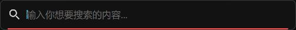
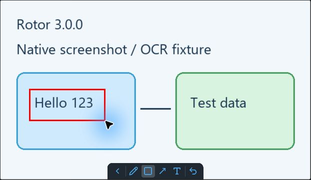
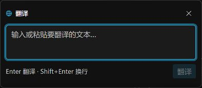
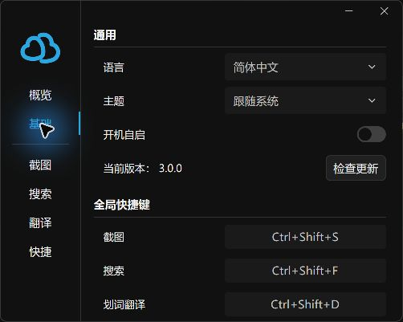

# Native UI screenshots

Captured on Windows, 2026-09-11, using isolated synthetic profiles and the actual
GPUI views. These images are not mockups and contain no user documents or secrets.

- `settings.png`: the application's general settings page.
- `annotation.png`: a restored native pin containing a generated test fixture;
  a rectangle was drawn using the native annotation toolbar.
- `search.png` and `translation.png` use the `ui_gallery` desktop example, which
  creates a fresh temporary profile and disables file indexing. They do not prove
  indexing throughput, real-provider availability or global shortcut behavior.

Reproduce previews with `cargo run -p rotor-desktop --example ui_gallery --release
-- search` or replace `search` with `translation`. Normal application behavior is
tested separately; this example does not install startup entries or register
global shortcuts.

The example hosts the unmodified views in ordinary windows so screenshot tools
can inspect them. The application retains its popup activation/closing behavior.

## Search

## Screenshot annotation

## Translation

## Settings

